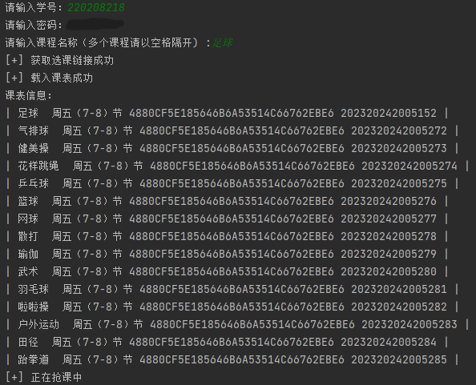

【注】：代码尚未使用，报错请自行调试
<br/>    抢课前请查看目标课程是否在返回的课程列表中，否则可能会陷入死循环
<br/><br/>运行：
```
python main.py
>>> 请输入学号：220208218
>>> 请输入密码：*******************
>>> 请输入课程名称：足球 健美操
```

<br/>说明：
```
输入课程名称规则：
  1.教务系统中课程完整名称中包含输入的名称即可
  例如：'乒乓球' 中包含 '乒乓'，输入 乒乓 即可正常抢课

  2.抢多个课程时，名称请使用空格间隔
  例如：足球 乒乓 健美操
```
<br/>API：
```
教务系统：http://qzjwxt.kjxy.nchu.edu.cn:800

登入：http://qzjwxt.kjxy.nchu.edu.cn:800/jsxsd/xk/LoginToXk

选选课列表：http://qzjwxt.kjxy.nchu.edu.cn:800/jsxsd/xsxk/xklc_list

选课列表：http://qzjwxt.kjxy.nchu.edu.cn:800jsxsd/xsxkkc/xsxkBxxk

选择课程：http://qzjwxt.kjxy.nchu.edu.cn:800/jsxsd/xsxkkc/bxxkOper?kcid={*******}&cfbs=null&jx0404id={*****}'
                        
```
